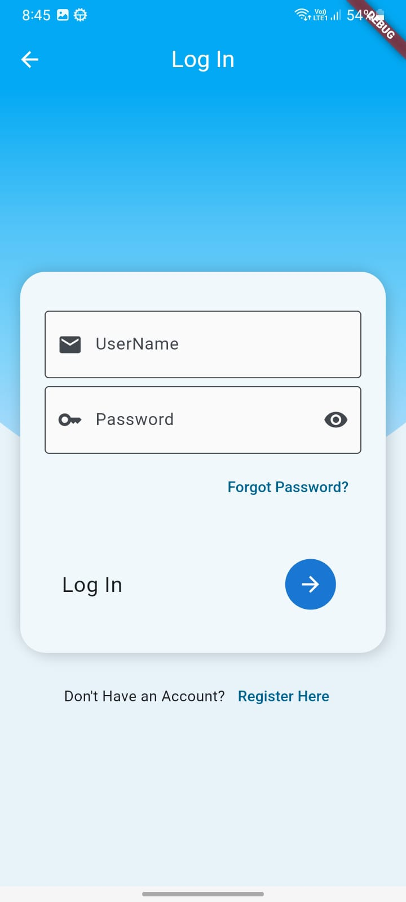
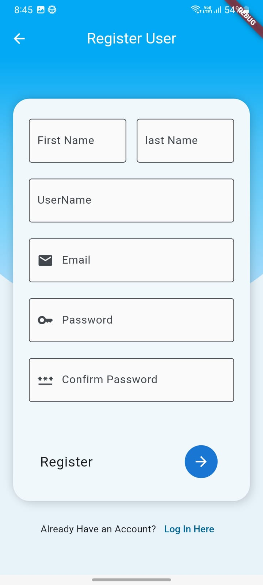
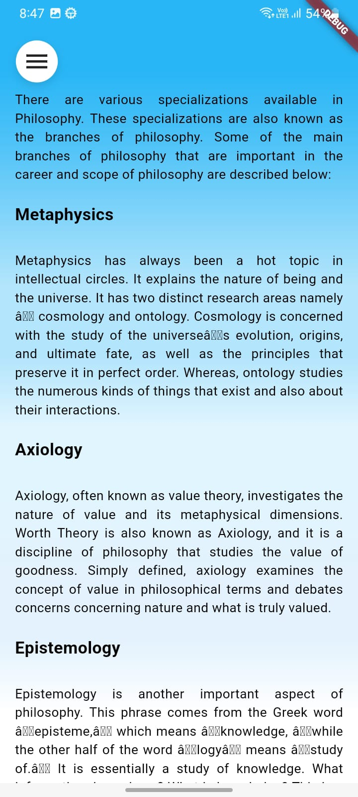

# Flutter Career UI
Flutter Career UI is a cross-platform application designed for Android and iOS to assist students in choosing their career paths. It provides a collection of articles and blogs to help students reference potential career paths.

---

<p float="left">
   
    
   
</p>

---

<p float="left">
    
    
    
</p>

---

## Features

1. **Articles and Blogs**
   - Access a curated collection of articles and blogs to explore various career paths.
   - Find valuable insights and information to aid in decision-making.

2. **Flutter Framework**
   - Built using the Flutter framework, allowing for a seamless and consistent user experience across different platforms.
   - Written in Dart language, making it easy to understand and maintain.

3. **API Requests**
   - Sends API requests to a Django server for fetching data.
   - Retrieves articles and blog information dynamically to keep the content up-to-date.

4. **Login Interface**
   - Provides a login interface for users to access personalized content and features.
   - Secure authentication mechanism ensures user privacy and data protection.

---

<p float="left">
    
    
    
</p>

---

## Installation
1. Ensure you have Flutter SDK installed on your system. If not, follow the official Flutter installation guide: [Flutter Installation Guide](https://flutter.dev/docs/get-started/install)

2. Clone the repository:
   ```bash
   git clone https://github.com/EnthusiasticXcoder/Flutter-Career-UI.git
   ```

3. Change to the project directory:
   ```bash
   cd Flutter-Career-UI
   ```

4. Fetch the project dependencies:
   ```bash
   flutter pub get
   ```

5. Run the application:
   ```bash
   flutter run
   ```

## Contributing
Contributions are welcome! If you'd like to contribute to this project, please follow these steps:

1. Fork the repository.
2. Create a new branch for your feature or bug fix.
3. Make your changes and commit them with descriptive commit messages.
4. Push your changes to your forked repository.
5. Submit a pull request to the main repository.

## License
This project is licensed under the MIT License. See the [LICENSE](LICENSE) file for more details.

## Acknowledgements
- [Flutter](https://flutter.dev/) - UI toolkit for building beautiful applications